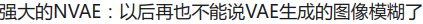

# Characters Recognition

A Chinese characters recognition prototype based on convolutional recurrent networks. 

## Performance

#### Recognize characters in pictures

<p align='center'>
</img>
</p>


<p align='center'>
</img>
</p>

## Dev Environments
1. Ubuntu 20.04
2. **PyTorch 1.10** with cuda 11.1 
3. yaml
4. easydict
5. tensorboardX

### Data
#### Synthetic Chinese String Dataset
1. Download the [dataset](https://pan.baidu.com/s/1ufYbnZAZ1q0AlK7yZ08cvQ)
2. Edit **lib/config/360CC_config.yaml** DATA:ROOT to you image path

```angular2html
    DATASET:
      ROOT: 'to/your/images/path'
```

3. Download the [labels](https://pan.baidu.com/s/1oOKFDt7t0Wg6ew2uZUN9xg) (password: eaqb)
4. Put *char_std_5990.txt* in **lib/dataset/txt/**
5. And put *train.txt* and *test.txt* in **lib/dataset/txt/**

    eg. test.txt
```
    20456343_4045240981.jpg 89 201 241 178 19 94 19 22 26 656
    20457281_3395886438.jpg 120 1061 2 376 78 249 272 272 120 1061
    ...
```
#### Or your other data
1. Edit **lib/config/OWN_config.yaml** DATA:ROOT to you image path
```angular2html
    DATASET:
      ROOT: 'to/your/images/path'
```
2. And put your *train_own.txt* and *test_own.txt* in **lib/dataset/txt/**

    eg. test_own.txt
```
    20456343_4045240981.jpg 你好啊！世界！
    20457281_3395886438.jpg 晚安啊！世界！
    ...
``` 
**note**: fixed-length training is supported. yet you can modify dataloader to support random length training.   

## Train
```angular2html
   [run] python train.py --cfg lib/config/360CC_config.yaml
or [run] python train.py --cfg lib/config/OWN_config.yaml
```
```
#### loss curve

```angular2html
   [run] cd output/360CC/crnn/xxxx-xx-xx-xx-xx/
   [run] tensorboard --logdir log
```

#### loss overview(first epoch)
<center/>
</img>
</center>
<p>
</img>
</p>

## Demo
```angular2html
   [run] python demo.py --image_path images/test.png --checkpoint output/checkpoints/a.pth
```
## References
- https://arxiv.org/pdf/1507.05717v1.pdf
- https://www.cs.toronto.edu/~graves/icml_2006.pdf
- https://github.com/meijieru/crnn.pytorch
- https://github.com/xiaofengShi/CHINESE-OCR
- https://cxyzjd.com/article/dbdxwyl/110449240
- https://blog.csdn.net/dbdxwyl/article/details/110449240
- http://xiaofengshi.com/2019/01/05/%E6%B7%B1%E5%BA%A6%E5%AD%A6%E4%B9%A0-OCR_Overview/
